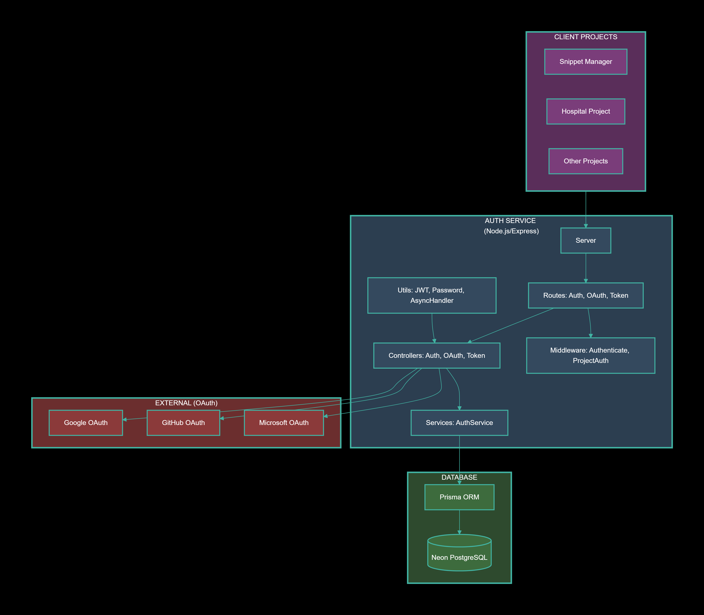
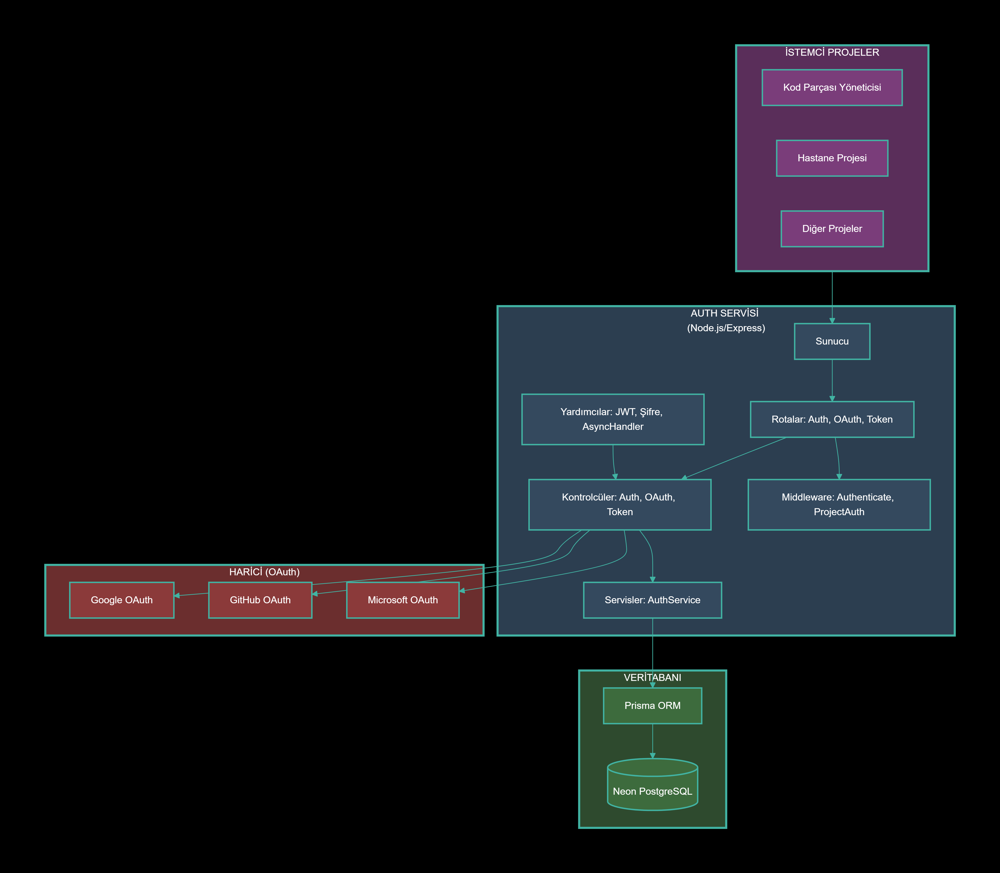

# Central Authentication Service

<a id="english"></a>

**English** | [Türkçe](#turkish)

A centralized authentication microservice for Express applications.

`auth-service` handles user registration, login, JWT-based session management, OAuth2 (Google, GitHub, Microsoft), project-based multi-tenancy with API key validation, and refresh token rotation. It sits in the center of the stack and owns credential storage, token issuance, and user lifecycle. Frontend clients never touch API keys directly; backend services attach project credentials before forwarding requests.

---

## Flowchart of the project

<p align="center">
  
  <br />
  <em>Request flow: frontend → backend → auth service → database.</em>
</p>

---

## Tech Stack

| Layer           | Technology                                 |
|-----------------|--------------------------------------------|
| Runtime         | Node.js 22                                 |
| Framework       | Express                                    |
| ORM             | Prisma                                     |
| Database        | PostgreSQL 15                              |
| Auth            | JWT (access + refresh), Passport.js        |
| OAuth Providers | Google, GitHub, Microsoft                  |
| Security        | Helmet, CORS, express-rate-limit, bcryptjs |
| Container       | Docker, Docker Compose                     |

---

## Installation

```bash
git clone https://github.com/BMDINNER/auth-service.git
cd auth-service
npm install
npx prisma generate
```

Copy the environment file and fill in your secrets:

```bash
cp .env.example .env
```

---

## Quick Start

### With Docker Compose

```bash
docker compose up --build
```

The service will be available at `http://localhost:3001`.

### Local Development

```bash
npx prisma migrate dev
npm run dev
```

---

## Environment Variables

| Variable                  | Required | Description                        |
|---------------------------|----------|------------------------------------|
| `DATABASE_URL`            | Yes      | PostgreSQL connection string       |
| `JWT_SECRET`              | Yes      | Secret for signing access tokens   |
| `JWT_REFRESH_SECRET`      | Yes      | Secret for signing refresh tokens  |
| `PORT`                    | No       | Server port (default: `3001`)      |
| `NODE_ENV`                | No       | `development` or `production`      |
| `CLIENT_URL`              | No       | Frontend URL for OAuth redirects   |
| `ALLOWED_ORIGINS`         | No       | Comma-separated extra CORS origins |
| `GOOGLE_CLIENT_ID`        | No       | Google OAuth client ID             |
| `GOOGLE_CLIENT_SECRET`    | No       | Google OAuth client secret         |
| `GOOGLE_CALLBACK_URL`     | No       | Google OAuth callback URL          |
| `GITHUB_CLIENT_ID`        | No       | GitHub OAuth client ID             |
| `GITHUB_CLIENT_SECRET`    | No       | GitHub OAuth client secret         |
| `GITHUB_CALLBACK_URL`     | No       | GitHub OAuth callback URL          |
| `MICROSOFT_CLIENT_ID`     | No       | Microsoft OAuth client ID          |
| `MICROSOFT_CLIENT_SECRET` | No       | Microsoft OAuth client secret      |
| `MICROSOFT_CALLBACK_URL`  | No       | Microsoft OAuth callback URL       |

The service will refuse to start if `JWT_SECRET`, `JWT_REFRESH_SECRET`, or `DATABASE_URL` are missing.

---

## API

### Auth Routes, `/auth`

| Method | Path                     | Auth    | Description                                   |
|--------|--------------------------|---------|-----------------------------------------------|
| `POST` | `/auth/register`         | None    | Register a new user                           |
| `POST` | `/auth/login`            | None    | Login with email and password                 |
| `POST` | `/auth/refresh`          | None    | Exchange refresh token for a new access token |
| `POST` | `/auth/logout`           | Bearer  | Invalidate refresh token                      |
| `GET`  | `/auth/verify`           | Bearer  | Verify token and return user                  |
| `PUT`  | `/auth/email`            | Bearer  | Update email                                  |
| `PUT`  | `/auth/change-password`  | Bearer  | Change password                               |
| `POST` | `/auth/projects`         | Bearer  | Create a new project                          |
| `POST` | `/auth/project/register` | API Key | Project-scoped registration                   |
| `POST` | `/auth/project/login`    | API Key | Project-scoped login                          |

### OAuth Routes, `/auth/oauth`

| Method | Path                             | Description                |
|--------|----------------------------------|----------------------------|
| `GET`  | `/auth/oauth/google`             | Start Google OAuth flow    |
| `GET`  | `/auth/oauth/google/callback`    | Google callback            |
| `GET`  | `/auth/oauth/github`             | Start GitHub OAuth flow    |
| `GET`  | `/auth/oauth/github/callback`    | GitHub callback            |
| `GET`  | `/auth/oauth/microsoft`          | Start Microsoft OAuth flow |
| `GET`  | `/auth/oauth/microsoft/callback` | Microsoft callback         |

### Token Routes, `/auth/token`

| Method | Path                           | Description                |
|--------|--------------------------------|----------------------------|
| `GET`  | `/auth/token/verify`           | Verify an access token     |
| `POST` | `/auth/token/revoke`           | Revoke a refresh token     |
| `POST` | `/auth/token/blacklist`        | Blacklist an access token  |
| `POST` | `/auth/token/validate-session` | Validate an active session |

### Health

| Method | Path      | Description                           |
|--------|-----------|---------------------------------------|
| `GET`  | `/health` | Basic health check                    |
| `GET`  | `/ping`   | Health check with DB connectivity     |
| `POST` | `/ping`   | Same as GET, for load balancer probes |

---

## Project Scoping

Every user belongs to one or more projects via the `ProjectUser` join table. Each project has its own `apiKey`. When a client backend forwards a request to this service, it must attach:

- `x-api-key` header, the project's API key
- `projectId`, in the body or `x-project-id` header

This keeps credentials out of the frontend. The browser sends only user credentials to the backend, and the backend attaches project credentials before forwarding.

See [@bmdinner/logreg](https://github.com/BMDINNER/LogReg) for the frontend counterpart.

---

## Architecture Notes

### Where credentials live

- The frontend sends only user credentials (email, password, form data) to its backend.
- The backend attaches `apiKey` and `projectId` before forwarding to this service.
- This service never trusts the frontend for project identity.

### Where sessions live

- Access tokens: 15 minutes, signed JWT.
- Refresh tokens: 7 days, stored in the `User.refreshToken` field.
- OAuth tokens: stored in the `OAuthToken` table with expiry.
- Session records: stored in the `Session` table for server-side invalidation.

### Token revocation

- Blacklisted access tokens are stored in an in-memory `Map` with TTL matching the token's remaining lifetime. This is cleared on restart, so a Redis-backed store is the production path.
- `blacklistUserTokens` invalidates all of a user's tokens at once by rotating their token ID.

---

## Struggles and Solutions

Notes on problems I ran into while building and deploying this service, and what I did about them.

### CORS issues on first deploy

**The struggle:** After deploying the service to Render for the first time, every request from the frontend was rejected by CORS. The origin list was hardcoded, and the deployed frontend URL wasn't in it.

**What I did:** Added an `ALLOWED_ORIGINS` environment variable that accepts a comma-separated list. The CORS middleware merges static origins with whatever is passed in. Now I can add deployed URLs through Render's dashboard without touching code.

---

### Reset password and forgot password blocked by CSP

**The struggle:** The reset password and forgot password flows redirected users to static HTML pages where they could set a new password. These pages were blocked by Content Security Policy, first because of a Google Font import, then because of Helmet's default CSP directives, and possibly also by Render's own load balancer or middleware.

**What I tried:**

1. Configuring Helmet's CSP directives manually, didn't fully resolve it.
2. Removing the Google Font, didn't resolve it.
3. Eventually removed `forgot-password` and `reset-password` features from the live deployment.

**Current status:** Working on a proper fix. The plan is to serve the reset form as a route within the frontend app instead of a static HTML page, so it inherits the app's own CSP context.

---

### OAuth2 blocked by CSP on the live deployment

**The struggle:** Google and GitHub OAuth2 login flows were blocked on the live Render deployment. The same flows work correctly in local development.

**What I found:** The block appears to come from Render's load balancer or middleware, not from the service itself. The CSP headers my service sets are correct, and OAuth requests pass through fine locally. On Render, they get intercepted before reaching the service.

**Current status:** Local OAuth works. Live OAuth is blocked. For a video demonstration of the local flow, see my portfolio page.

---

### Render's free tier sleeps and doesn't wake up

**The struggle:** Render changed their free tier policy. After a `SIGTERM` from inactivity, the service would no longer wake up on incoming requests. It just stayed down.

**What I did:** Added a cronjob that pings the `/ping` endpoint every 14 minutes, running for 12 hours every day. This keeps the service active and prevents the shutdown from triggering. The `/ping` endpoint also reconnects to the database if the connection has dropped, so the service is fully functional when it responds.

---

## Docker

### Build

```bash
docker build -t auth-service .
```

### Run

```bash
docker run -p 3001:3001 --env-file .env auth-service
```

### Docker Compose

The included `docker-compose.yml` spins up both PostgreSQL and the service, connects them on a shared network, and waits for the database health check before starting the service.

```bash
docker compose up --build
```

The service container runs `prisma migrate deploy` on startup, so migrations are applied automatically.

---

## Database Schema

| Model         | Purpose                                                               |
|---------------|-----------------------------------------------------------------------|
| `User`        | Core user record with optional password, provider info, refresh token |
| `Project`     | Multi-tenant boundary with unique `apiKey`                            |
| `ProjectUser` | Join table linking users to projects with per-project role            |
| `OAuthToken`  | Access and refresh tokens issued by OAuth providers                   |
| `Session`     | Server-side session records                                           |
| `OAuthClient` | Registered OAuth clients with redirect URIs and grants                |

---

## License

MIT

---
<a id="turkish"></a>

# Merkezi Tanımlama Servisi

[English](#english) | **Türkçe**

Express uygulamaları için merkezi bir kimlik doğrulama mikroservisi.

`auth-service`; kullanıcı kaydı, giriş, JWT tabanlı oturum yönetimi, OAuth2 (Google, GitHub, Microsoft), API anahtarı doğrulamalı proje bazlı çoklu kiracılık ve refresh token rotasyonu işlemlerini yönetir. Yığının merkezinde durur ve kimlik bilgisi saklama, token üretimi ve kullanıcı yaşam döngüsünün sahibidir. Frontend istemcileri API anahtarlarına asla doğrudan dokunmaz; backend servisleri istekleri iletmeden önce proje kimlik bilgilerini ekler.

---

## Projenin Akış Diyagramı

<p align="center">
  
  <br />
  <em>İstek akışı: frontend → backend → auth service → veritabanı.</em>
</p>

---

## Teknoloji Yığını

| Katman              | Teknoloji                                  |
|---------------------|--------------------------------------------|
| Çalışma Ortamı      | Node.js 22                                 |
| Framework           | Express                                    |
| ORM                 | Prisma                                     |
| Veritabanı          | PostgreSQL 15                              |
| Kimlik Doğrulama    | JWT (access + refresh), Passport.js        |
| OAuth Sağlayıcıları | Google, GitHub, Microsoft                  |
| Güvenlik            | Helmet, CORS, express-rate-limit, bcryptjs |
| Konteyner           | Docker, Docker Compose                     |

---

## Kurulum

```bash
git clone https://github.com/BMDINNER/auth-service.git
cd auth-service
npm install
npx prisma generate
```

Ortam dosyasını kopyalayın ve secret'larınızı doldurun:

```bash
cp .env.example .env
```

---

## Başlangıç ve Kullanım

### Docker Compose ile

```bash
docker compose up --build
```

Servis `http://localhost:3001` adresinde çalışacaktır.

### Yerel Geliştirme

```bash
npx prisma migrate dev
npm run dev
```

---

## Ortam Değişkenleri

| Değişken                  | Zorunlu | Açıklama                                   |
|---------------------------|---------|--------------------------------------------|
| `DATABASE_URL`            | Evet    | PostgreSQL bağlantı dizesi                 |
| `JWT_SECRET`              | Evet    | Access token imzalama anahtarı             |
| `JWT_REFRESH_SECRET`      | Evet    | Refresh token imzalama anahtarı            |
| `PORT`                    | Hayır   | Sunucu portu (varsayılan: `3001`)          |
| `NODE_ENV`                | Hayır   | `development` veya `production`            |
| `CLIENT_URL`              | Hayır   | OAuth yönlendirmeleri için frontend URL'si |
| `ALLOWED_ORIGINS`         | Hayır   | Virgülle ayrılmış ek CORS origin'leri      |
| `GOOGLE_CLIENT_ID`        | Hayır   | Google OAuth client ID                     |
| `GOOGLE_CLIENT_SECRET`    | Hayır   | Google OAuth client secret                 |
| `GOOGLE_CALLBACK_URL`     | Hayır   | Google OAuth callback URL'si               |
| `GITHUB_CLIENT_ID`        | Hayır   | GitHub OAuth client ID                     |
| `GITHUB_CLIENT_SECRET`    | Hayır   | GitHub OAuth client secret                 |
| `GITHUB_CALLBACK_URL`     | Hayır   | GitHub OAuth callback URL'si               |
| `MICROSOFT_CLIENT_ID`     | Hayır   | Microsoft OAuth client ID                  |
| `MICROSOFT_CLIENT_SECRET` | Hayır   | Microsoft OAuth client secret              |
| `MICROSOFT_CALLBACK_URL`  | Hayır   | Microsoft OAuth callback URL'si            |

`JWT_SECRET`, `JWT_REFRESH_SECRET` veya `DATABASE_URL` eksikse servis başlamayı reddeder.

---

## API

### Auth Rotaları, `/auth`

| Metot  | Yol                      | Yetki   | Açıklama                               |
|--------|--------------------------|---------|----------------------------------------|
| `POST` | `/auth/register`         | Yok     | Yeni kullanıcı kaydı                   |
| `POST` | `/auth/login`            | Yok     | E-posta ve şifre ile giriş             |
| `POST` | `/auth/refresh`          | Yok     | Refresh token ile yeni access token al |
| `POST` | `/auth/logout`           | Bearer  | Refresh token'ı geçersiz kıl           |
| `GET`  | `/auth/verify`           | Bearer  | Token'ı doğrula ve kullanıcıyı döndür  |
| `PUT`  | `/auth/email`            | Bearer  | E-posta güncelle                       |
| `PUT`  | `/auth/change-password`  | Bearer  | Şifre değiştir                         |
| `POST` | `/auth/projects`         | Bearer  | Yeni proje oluştur                     |
| `POST` | `/auth/project/register` | API Key | Proje kapsamlı kayıt                   |
| `POST` | `/auth/project/login`    | API Key | Proje kapsamlı giriş                   |

### OAuth Rotaları, `/auth/oauth`

| Metot | Yol | Açıklama |
|-------|-----|----------|
| `GET` | `/auth/oauth/google` | Google OAuth akışını başlat |
| `GET` | `/auth/oauth/google/callback` | Google callback |
| `GET` | `/auth/oauth/github` | GitHub OAuth akışını başlat |
| `GET` | `/auth/oauth/github/callback` | GitHub callback |
| `GET` | `/auth/oauth/microsoft` | Microsoft OAuth akışını başlat |
| `GET` | `/auth/oauth/microsoft/callback` | Microsoft callback |

### Token Rotaları, `/auth/token`

| Metot  | Yol                            | Açıklama                       |
|--------|--------------------------------|--------------------------------|
| `GET`  | `/auth/token/verify`           | Access token'ı doğrula         |
| `POST` | `/auth/token/revoke`           | Refresh token'ı iptal et       |  
| `POST` | `/auth/token/blacklist`        | Access token'ı kara listeye al |
| `POST` | `/auth/token/validate-session` | Aktif oturumu doğrula          |

### Sağlık Kontrolü

| Metot  | Yol       | Açıklama                                   |
|--------|-----------|--------------------------------------------|
| `GET`  | `/health` | Temel sağlık kontrolü                      |
| `GET`  | `/ping`   | Veritabanı bağlantısı ile sağlık kontrolü  |
| `POST` | `/ping`   | Load balancer probe'ları için GET ile aynı |

---

## Proje Kapsamlandırma

Her kullanıcı, `ProjectUser` join tablosu üzerinden bir veya daha fazla projeye aittir. Her projenin kendi `apiKey` değeri vardır. Bir istemci backend'i bu servise istek ilettiğinde şunları eklemelidir:

- `x-api-key` header'ı, projenin API anahtarı
- `projectId`, body içinde veya `x-project-id` header'ında

Bu, kimlik bilgilerini frontend'den uzak tutar. Tarayıcı backend'e yalnızca kullanıcı kimlik bilgilerini gönderir, backend ise proje kimlik bilgilerini iletmeden önce ekler.

Frontend tarafı için [@bmdinner/logreg](https://github.com/BMDINNER/LogReg) paketine bakın.

---

## Mimari Notları

### Kimlik bilgileri nerede tutulur

- Frontend, backend'ine yalnızca kullanıcı kimlik bilgilerini (e-posta, şifre, form verisi) gönderir.
- Backend, bu servise iletmeden önce `apiKey` ve `projectId` ekler.
- Bu servis, proje kimliği için frontend'e asla güvenmez.

### Oturumlar nerede tutulur

- Access token'lar: 15 dakika, imzalı JWT.
- Refresh token'lar: 7 gün, `User.refreshToken` alanında saklanır.
- OAuth token'ları: `OAuthToken` tablosunda son kullanma tarihiyle saklanır.
- Oturum kayıtları: sunucu taraflı geçersiz kılma için `Session` tablosunda saklanır.

### Token iptali

- Kara listeye alınan access token'lar, token'ın kalan ömrüne eşit TTL ile bellekteki bir `Map`'te saklanır. Bu, yeniden başlatmada temizlenir, bu yüzden Redis destekli bir depo üretim yoludur.
- `blacklistUserTokens`, kullanıcının token ID'sini döndürerek tüm token'larını tek seferde geçersiz kılar.

---

## Karşılaşılan Sorunlar ve Çözümleri

Bu servisi geliştirirken ve deploy ederken karşılaştığım sorunlar ve bunlara bulduğum çözümler.

### İlk deploy'da CORS sorunları

**Sorun:** Servisi ilk kez Render'a deploy ettikten sonra frontend'den gelen her istek CORS tarafından reddediliyordu. Origin listesi sabit kodluydu ve deploy edilen frontend URL'si listede yoktu.

**Çözümüm:** Virgülle ayrılmış liste kabul eden bir `ALLOWED_ORIGINS` ortam değişkeni ekledim. CORS middleware'i statik origin'leri gelen değerlerle birleştiriyor. Artık kod dokunmadan Render panelinden deploy edilen URL'leri ekleyebiliyorum.

---

### Şifre sıfırlama ve şifremi unuttum CSP tarafından bloklandı

**Sorun:** Şifre sıfırlama ve şifremi unuttum akışları, kullanıcıları yeni şifre belirleyebilecekleri statik HTML sayfalarına yönlendiriyordu. Bu sayfalar Content Security Policy tarafından bloklandı; önce bir Google Font importu nedeniyle, sonra Helmet'in varsayılan CSP direktifleri nedeniyle, ve muhtemelen Render'ın kendi load balancer'ı veya middleware'i tarafından da.

**Denediklerim:**

1. Helmet'in CSP direktiflerini manuel olarak yapılandırdım, tam olarak çözmedi.
2. Google Font'u kaldırdım, çözmedi.
3. Sonunda `forgot-password` ve `reset-password` özelliklerini canlı deployment'tan kaldırdım.

**Mevcut durum:** Düzgün bir çözüm üzerinde çalışıyorum. Plan, sıfırlama formunu statik HTML sayfası yerine frontend uygulaması içinde bir rota olarak sunmak, böylece uygulamanın kendi CSP bağlamını devralır.

---

### OAuth2 canlı deployment'ta CSP tarafından bloklandı

**Sorun:** Google ve GitHub OAuth2 giriş akışları canlı Render deployment'ında bloklandı. Aynı akışlar yerel geliştirmede doğru çalışıyor.

**Bulduğum:** Blok, servisin kendisinden değil, Render'ın load balancer'ından veya middleware'inden geliyor gibi görünüyor. Servisimin ayarladığı CSP header'ları doğru ve OAuth istekleri yerelde sorunsuz geçiyor. Render'da ise servise ulaşmadan önce kesiliyorlar.

**Mevcut durum:** Yerel OAuth çalışıyor. Canlı OAuth bloklu. Yerel akışın video gösterimi için portfolio sayfama bakabilirsiniz.

---

### Render'ın ücretsiz katmanı uyuyor ve uyanmıyor

**Sorun:** Render ücretsiz katman politikasını değiştirdi. Hareketsizlikten gelen bir `SIGTERM` sonrasında servis artık gelen isteklerle uyanmıyordu. Sadece kapalı kalıyordu.

**Çözümüm:** `/ping` endpoint'ini her 14 dakikada bir, günde 12 saat boyunca pingleyen bir cronjob ekledim. Bu, servisi aktif tutar ve kapanmanın tetiklenmesini engeller. `/ping` endpoint'i ayrıca bağlantı düşmüşse veritabanına yeniden bağlanır, böylece servis yanıt verdiğinde tam işlevsel olur.

---

## Docker

### Build

```bash
docker build -t auth-service .
```

### Çalıştırma

```bash
docker run -p 3001:3001 --env-file .env auth-service
```

### Docker Compose

Dahil edilen `docker-compose.yml` hem PostgreSQL'i hem de servisi ayağa kaldırır, ikisini ortak bir ağda birleştirir ve servisi başlatmadan önce veritabanı sağlık kontrolünü bekler.

```bash
docker compose up --build
```

Servis konteyneri başlangıçta `prisma migrate deploy` çalıştırır, böylece migration'lar otomatik uygulanır.

---

## Veritabanı Şeması

| Model         | Amaç |
|---------------|----------------------------------------------------------------------------------|
| `User`        | İsteğe bağlı şifre, sağlayıcı bilgisi, refresh token içeren core kullanıcı kaydı |
| `Project`     | Benzersiz `apiKey` ile çoklu kiracılık sınırı                                    |
| `ProjectUser` | Kullanıcıları proje bazlı rolle projelere bağlayan join tablosu                  |
| `OAuthToken`  | OAuth sağlayıcıları tarafından verilen access ve refresh token'lar               |
| `Session`     | Sunucu taraflı oturum kayıtları                                                  |
| `OAuthClient` | Redirect URI'leri ve grant'leri ile kayıtlı OAuth istemcileri                    |

---

## Lisans

MIT
